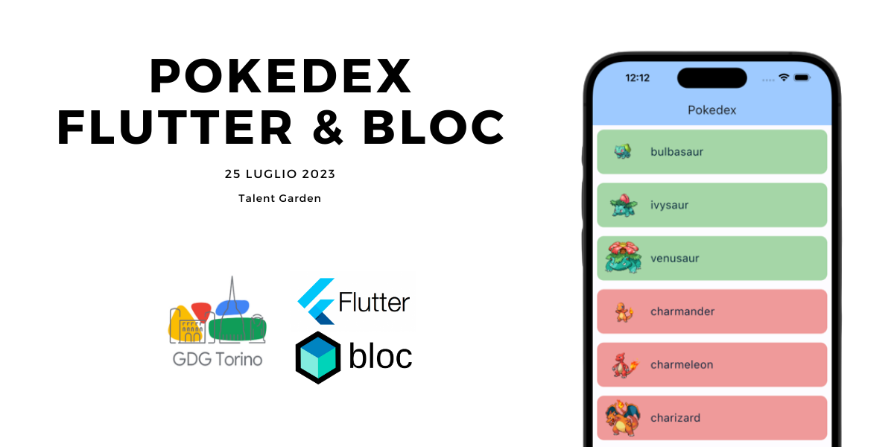

# GDG Pokedex 

Project for the 25 July 2023 Turin GDG presentation.

This is a Flutter project demonstrating the use of Bloc for state management, represented through a Pokedex UI. 
The app allows users to fetch Pokemon data, automatically load more entries upon reaching the end of the page, and toggle a 'caught' status for each Pokemon by clicking on its card.

## Getting Started

The project is fully open source with a [MIT License](LICENSE).

To follow along with the workshop we are using [Zapp!](https://zapp.run/), an online editor for Flutter.
This allows to skip configuration and versioning on every partecipant device.

The project makes use of [PokéAPI](https://pokeapi.co/) for data fetching.

### Branches

There are a couple of branches available.

- main --> Completed version. 
    - Zapp link [here](https://zapp.run/github/GangemiLorenzo/gdg_pokedex/tree/main)
- workshop --> Workshop version.
    - The project is not working as it is.
    - It contains folders divided in step that can be used during the presentation to follow along.
    - Zapp link [here](https://zapp.run/github/GangemiLorenzo/gdg_pokedex/tree/workshop)

